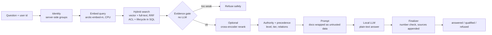

<div align="center">

# Production RAG

### Enterprise knowledge answers that are grounded, permission-safe, and honest when they don't know.

A fully offline Retrieval-Augmented Generation service running on local CPU models (no GPU, no cloud, no API keys), where **code decides security and trust**, and the LLM only writes prose from evidence that was already filtered.


Built for [Code Quests #88 (Kentrick.ai): Production RAG](https://code-quests.com/quests-details/?id=88)


</div>

---

## Why this project

Most RAG demos answer confidently. Enterprise RAG has to answer **correctly, for the right person, or not at all**. This project targets the four failure modes that actually hurt companies:

| Incident | What goes wrong in naive RAG | What this project does |
|---|---|---|
| **Wrong policy becomes the answer** | A retired v2.1 policy outranks the current v3 because it scored higher | Lifecycle + authority layer: status, supersedes/amends relations, org level and document tier decide precedence, not cosine |
| **Convincing unsupported answer** | The model invents an SLA that the contract never states | Answer finalizer: any number the evidence does not contain downgrades the answer to *qualified* with a warning; sources are appended by code, never by the model |
| **Security failure** | An engineer asking about leave sees a confidential HR investigation; a document says "ignore your rules" | ACL pre-filter in SQL (restricted chunks never enter the candidate set) + ingest-time prompt-injection scanner that caps malicious docs at the lowest trust tier |
| **Undetected regression** | A model or prompt change silently breaks behavior | Unit + contract test suites and a traceable pipeline run for every question |

## See it in action

**Same pipeline, different user.** An engineer asking about a confidential HR case gets a safe refusal. The restricted document was never retrieved, so the LLM was never called and nothing leaks into prompts, citations or logs.


<details>
<summary><b>Full diagnostics view</b> (embedding stats, retrieved chunks, evidence, raw LLM output)</summary>


</details>

## How it works



Order matters. Permissions are decided **before** retrieval, so even a fully fooled model cannot widen them.

### Highlights

- **Permission-consistent by construction.** Identity is resolved server-side from the pack's `identities.json`; `allowed_groups`, classification rules and `deny_groups` are enforced inside the SQL query, default deny.
- **Authority, not just relevance.** A reviewed [`data/authority.yaml`](data/authority.yaml) assigns each document a tier and org level, backed by quotes that are re-verified against the document text at every ingest. A quote that drifts fails the ingest.
- **Prompt-injection resistant.** [`injection.scanner.ts`](apps/api/src/modules/corpus/injection.scanner.ts) flags instruction-like content at ingest; flagged docs are forced to `unverified` and can never override policy.
- **Refuses without hallucinating.** A deterministic evidence gate refuses before any LLM call when nothing trustworthy is visible.
- **Plain-text answers, sources from code.** The LLM writes a short text answer; the finalizer appends the exact documents it was given (id, version, section, role) and flags unsupported numbers.
- **Supply-chain integrity.** Pack files are checked against `checksums.sha256` before ingest.
- **Hexagonal architecture.** Ports for embeddings, reranker, LLM and vector store with real and fake adapters, so every stage is testable offline and swappable (e.g. Azure OpenAI + Azure AI Search in production).
- **Fully offline, CPU only.** See [Offline CPU models](#offline-cpu-models). In-process ONNX embeddings via `@huggingface/transformers`, Postgres + pgvector in Docker, any OpenAI-compatible local LLM (Ollama, llama.cpp, vLLM).

## Tech stack

| Layer | Choice |
|---|---|
| API | NestJS 12 (ESM), TypeScript 6 |
| Vector store | Postgres 17 + pgvector 0.8 (hybrid vector + full-text) |
| Embeddings | `Snowflake/snowflake-arctic-embed-m-v1.5` (768d), in-process ONNX |
| Reranker (optional) | `Xenova/bge-reranker-base` cross-encoder |
| LLM | Any OpenAI-compatible endpoint, default `qwen3.5:0.8b-mlx` on Ollama |
| Config | `@nestjs/config` + zod, fail-fast validation |
| Tests | Vitest (unit + pgvector contract tests) |

## Offline CPU models

Every model runs on your machine, on CPU. No GPU, no API key, no cloud account. After the first download, the whole pipeline works with the network unplugged.

| Role | Model | Runtime | Size on disk | Why this one |
|---|---|---|---|---|
| Embeddings | [`Snowflake/snowflake-arctic-embed-m-v1.5`](https://huggingface.co/Snowflake/snowflake-arctic-embed-m-v1.5) (768d, fp32) | In-process ONNX via `@huggingface/transformers` | ~420 MB | Strong retrieval quality for its size, CLS pooling + query instruction, no extra server to run |
| Reranker (optional) | [`Xenova/bge-reranker-base`](https://huggingface.co/Xenova/bge-reranker-base) (q8) | In-process ONNX | ~280 MB | Cross-encoder for sharper ordering when `--rerank` is on, loaded only on first use |
| Answer LLM | [`qwen3.5:0.8b-mlx`](https://ollama.com/library/qwen3.5) (0.8B params) | [Ollama](https://ollama.com), OpenAI-compatible API | ~1.2 GB | MLX build, Apple Silicon only (elsewhere use `qwen3.5:0.8b`). Fastest option (about 10-20 s per answer on an M1), Apache 2.0 license. `qwen3.5:4b` gives more careful answers at about 30 s |

### Set up the models once

The embedding and reranker models download automatically on first use into `.cache/models`. The LLM comes from Ollama:

```bash
ollama pull qwen3.5:0.8b-mlx
```

Optional: give the model an 8K context window so larger evidence sets fit. Create a file named `Modelfile` with:

```
FROM qwen3.5:0.8b-mlx
PARAMETER num_ctx 8192
```

```bash
ollama create qwen3.5-0.8b-8k -f Modelfile
```

Then set `LLM_MODEL_ID=qwen3.5-0.8b-8k` in `.env`.

### Go fully offline

After the first ingest has cached the models, set this in `.env`:

```
EMBEDDING_ALLOW_REMOTE=false
LLM_BASE_URL=http://localhost:11434
LLM_API_KEY=
```

Nothing leaves the machine from then on: embeddings and reranking run inside the Node process, and the LLM is served by local Ollama.

### Measured on a laptop

Apple M1, 16 GB RAM, CPU only, question *"What is our process for approving a new enterprise vendor?"*:

| Stage | Time |
|---|---|
| Query embedding | ~1.4 s |
| Hybrid search (pgvector) | ~0.1 s |
| LLM answer (879 tokens in, 360 out) | ~104 s |

Refusals are fast: when no permitted evidence passes the gate, the LLM is never called and the answer returns in under 2 s.

### Swap models

Models are behind ports, so switching is a config change:

- **Another local LLM:** any OpenAI-compatible server (llama.cpp, LM Studio, vLLM). Set `LLM_BASE_URL` and `LLM_MODEL_ID`.
- **Another embedding model:** set `EMBEDDING_MODEL_ID` and `EMBEDDING_DIM`, then run `pnpm ingest --reindex`. The index records the model, dim, dtype and prefix scheme, and search refuses to run against a mismatched index instead of returning quietly wrong results.
- **Hosted in production:** point the same adapter at Azure OpenAI.

## Quick start

**Prerequisites:** Node >= 22.12, pnpm 10, Docker, and [Ollama](https://ollama.com) (or any OpenAI-compatible LLM server).

```bash
git clone https://github.com/khali70/production-rag.git
```

```bash
cd production-rag && pnpm install
```

```bash
cp .env.example .env
```

```bash
ollama pull qwen3.5:0.8b-mlx
```

```bash
pnpm db:up
```

```bash
pnpm build && pnpm migrate && pnpm ingest
```

```bash
pnpm --filter api start
```

Open **http://localhost:3001/**, pick a user, ask a question. The first run downloads the embedding model (~440 MB) into `.cache/models`; set `EMBEDDING_ALLOW_REMOTE=false` afterwards for fully offline runs.

### CLI

```bash
pnpm --filter api ask --user u-proc-310 "What is our process for approving a new enterprise vendor?"
```

```bash
pnpm trace "who approves a regulated vendor"
```

`trace` prints every pipeline step: embed, search, gate, rerank, authority, prompt, LLM, finalize.

### Tests

```bash
pnpm test
```

```bash
pnpm test:contract
```

## Project layout

```
apps/api/src
  ports/            EmbeddingPort, LlmPort, RerankerPort, VectorStorePort
  adapters/         transformers, openai-compat, pgvector, and fakes for tests
  domain/           precedence + tier rules (pure functions)
  modules/corpus/   pack loader, checksum verifier, ACL resolver, chunker, injection scanner, authority
  modules/answer/   embed -> search -> rerank -> generate stages, prompt builder, finalizer
  modules/http/     playground page + JSON API (localhost only)
  cli/              migrate, ingest, search, ask, trace
data/authority.yaml reviewed authority layer with evidence quotes
context/            design notes and decision records
Kentrick_Assessment_Pack_Candidate/  supplied synthetic corpus (read-only)
```

## Security notes

- The playground lets you **impersonate any pack user** for demo purposes, so the server binds to `127.0.0.1` only. Do not expose it to a network.
- All corpus data is **synthetic**, supplied by the quest. No real people, suppliers or contracts.

## Design docs

Decisions, trade-offs and thought experiments live in [`context/`](context/README.md): backend architecture, model choice, vector store design, sizing for 60K documents, and "what if" analyses.

## Links

- Quest: [Code Quests #88 (Kentrick.ai)](https://code-quests.com/quests-details/?id=88)
- Author: [@khali70](https://github.com/khali70)

If this project is useful to you, a star helps others find it.
