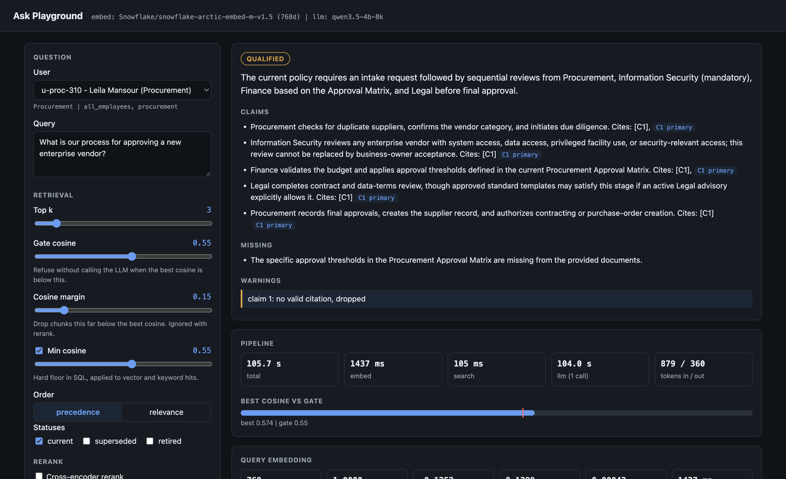
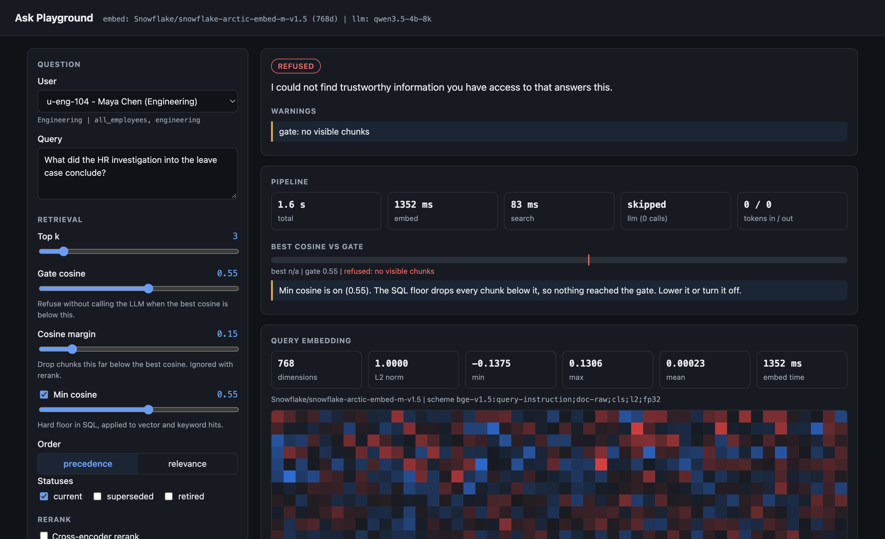
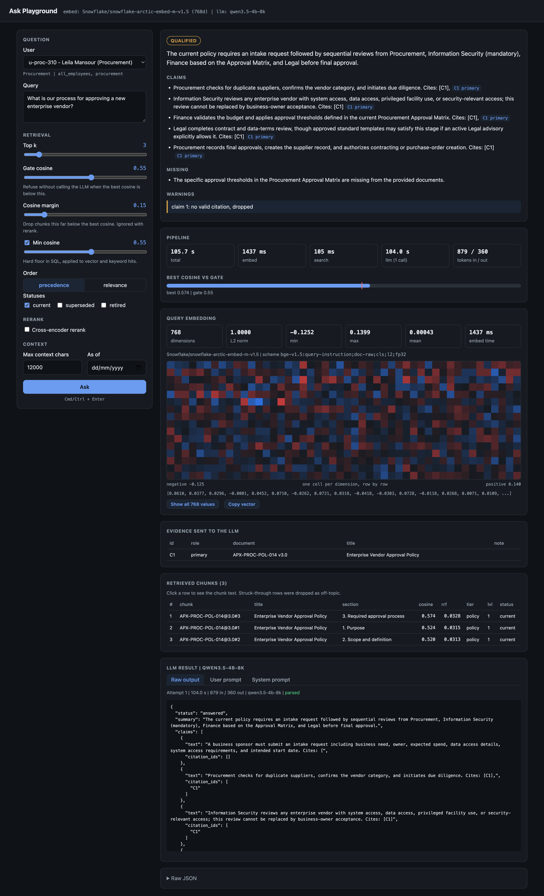

<div align="center">

# Production RAG

### Enterprise knowledge answers that are grounded, permission-safe, and honest when they don't know.

A fully offline Retrieval-Augmented Generation service running on local CPU models (no GPU, no cloud, no API keys), where **code decides security and trust**, and the LLM only writes prose from evidence that was already filtered.


Built for [Code Quests #88 (Kentrick.ai): Production RAG](https://code-quests.com/quests-details/?id=88)



</div>

---

## Why this project

Most RAG demos answer confidently. Enterprise RAG has to answer **correctly, for the right person, or not at all**. This project targets the four failure modes that actually hurt companies:

| Incident | What goes wrong in naive RAG | What this project does |
|---|---|---|
| **Wrong policy becomes the answer** | A retired v2.1 policy outranks the current v3 because it scored higher | Lifecycle + authority layer: status, supersedes/amends relations, org level and document tier decide precedence, not cosine |
| **Convincing unsupported answer** | The model invents an SLA that the contract never states | Answer finalizer: any number the evidence does not contain downgrades the answer to *qualified* with a warning; sources are appended by code, never by the model |
| **Security failure** | An engineer asking about leave sees a confidential HR investigation; a document says "ignore your rules" | ACL pre-filter in SQL (restricted chunks never enter the candidate set) + ingest-time prompt-injection scanner that caps malicious docs at the lowest trust tier |
| **Undetected regression** | A model or prompt change silently breaks behavior | `pnpm eval`: versioned incident cases plus paraphrases through the real pipeline, checked in code, exit 1 on any failure (release blocking). Unit + contract suites and a trace for every question |

## See it in action

**Same pipeline, different user.** An engineer asking about a confidential HR case gets a safe refusal. The restricted document was never retrieved, so the LLM was never called and nothing leaks into prompts, citations or logs.



<details>
<summary><b>Full diagnostics view</b> (embedding stats, retrieved chunks, evidence, raw LLM output)</summary>



</details>

## How it works

```mermaid
flowchart LR
    Q[Question + user id] --> I[Identity<br/>server-side groups]
    I --> E[Embed query<br/>arctic-embed-l v2, CPU]
    E --> S[Hybrid search<br/>vector + full-text, RRF<br/>ACL + lifecycle in SQL]
    S --> G{Evidence gate<br/>no LLM}
    G -- too weak --> R[Refuse safely]
    G -- ok --> RR[Cross-encoder rerank<br/>pool 8 -> top 3]
    RR -- default mode --> BM[Best match<br/>current version first,<br/>+ amending documents,<br/>returned verbatim, no LLM]
    RR -- llm mode --> RD[Related documents<br/>amends / qualifies, same ACL]
    RD --> VX[Other versions<br/>of each file found, same ACL]
    VX --> A[Authority + precedence<br/>level, tier, relations, priority]
    A --> P[Prompt<br/>per file: current + old versions,<br/>priority list, untrusted data]
    P --> L[Local LLM<br/>plain-text answer]
    L --> V[Finalizer<br/>number checks, sources appended]
    V --> OUT[answered / qualified / refused]
    BM --> OUT
```



Order matters. Permissions are decided **before** retrieval, so even a fully fooled model cannot widen them.

### Highlights

- **Permission-consistent by construction.** Identity is resolved server-side from the pack's `identities.json`; `allowed_groups`, classification rules and `deny_groups` are enforced inside the SQL query, default deny.
- **Authority, not just relevance.** A reviewed [`data/authority.yaml`](data/authority.yaml) assigns each document a tier and org level, backed by quotes that are re-verified against the document text at every ingest. A quote that drifts fails the ingest.
- **Old and current side by side.** Search covers every status the user may see. For each file found, the best chunks of its other versions are added, and the prompt groups them per file: the current version first, then the old ones marked `state="old"`. Every version carries a priority (1 wins) decided in code, repeated as a list right before the question, so the model can say "previously X, replaced by v3.0" without ever answering from a retired rule. A number that only an old version contains, stated as current, downgrades the answer.
- **Changes travel with what they change.** When search finds a policy, the documents that amend or qualify it (per the authority relations, e.g. the approval matrix and the legal memo for the vendor policy) are added too, filtered by the same ACL. A matrix whose wording scores lower than the policy's still reaches the model.
- **Prompt-injection resistant.** [`injection.scanner.ts`](apps/api/src/modules/corpus/injection.scanner.ts) flags instruction-like content at ingest; flagged docs are forced to `unverified` and can never override policy.
- **Refuses without hallucinating.** A deterministic evidence gate (best cosine below 0.40) returns nothing before any reranker or LLM call when nothing trustworthy is visible. A reply containing the refusal sentence anywhere is marked refused.
- **Plain-text answers, sources from code.** The LLM writes a short text answer; the finalizer appends the exact documents it was given (id, version, section, role) and flags unsupported numbers (digits, dates without leading zeros, `50k` shorthand and spelled-out numbers like "one hundred and fifty thousand").
- **Supply-chain integrity.** Pack files are checked against `checksums.sha256` before ingest.
- **Hexagonal architecture.** Ports for embeddings, reranker, LLM and vector store with real and fake adapters, so every stage is testable offline and swappable (e.g. Azure OpenAI + Azure AI Search in production).
- **Fully offline, CPU only.** See [Offline CPU models](#offline-cpu-models). In-process ONNX embeddings via `@huggingface/transformers`, Postgres + pgvector in Docker, any OpenAI-compatible local LLM (Ollama, llama.cpp, vLLM).

## Tech stack

| Layer | Choice |
|---|---|
| API | NestJS 12 (ESM), TypeScript 6 |
| Vector store | Postgres 17 + pgvector 0.8 (hybrid vector + full-text) |
| Embeddings | `Snowflake/snowflake-arctic-embed-l-v2.0` (1024d, q8), in-process ONNX |
| Reranker | `onnx-community/bge-reranker-v2-m3-ONNX` cross-encoder (q8) |
| LLM | Any OpenAI-compatible endpoint, default `qwen3.5:4b` (8K context) on Ollama |
| Config | `@nestjs/config` + zod, fail-fast validation |
| Tests | Vitest (unit + pgvector contract tests) |

## Offline CPU models

Every model runs on your machine, on CPU. No GPU, no API key, no cloud account. After the first download, the whole pipeline works with the network unplugged.

| Role | Model | Runtime | Size on disk | Why this one |
|---|---|---|---|---|
| Embeddings | [`Snowflake/snowflake-arctic-embed-l-v2.0`](https://huggingface.co/Snowflake/snowflake-arctic-embed-l-v2.0) (1024d, q8) | In-process ONNX via `@huggingface/transformers` | ~570 MB | Large retrieval model, CLS pooling + `query:` prefix. Separates questions the documents cannot answer: with a 0.40 cosine gate all 4 off-document test questions return nothing and no answerable one is lost except one short phrasing (C1b) |
| Reranker | [`bge-reranker-v2-m3`](https://huggingface.co/onnx-community/bge-reranker-v2-m3-ONNX) (q8) | In-process ONNX | ~570 MB | Strong cross-encoder; ranks the 8 search results and its best chunk is the default answer. Put the right chunk first for 36 of 48 answerable test questions (41 of 48 within its top 3). Still weak on the approval matrix table and contract SLA wording. About 7 s per question on an M1 |
| Answer LLM | [`qwen3.5:4b`](https://ollama.com/library/qwen3.5) (4B params) | [Ollama](https://ollama.com), OpenAI-compatible API | ~3.4 GB | Passed 49 of the pack's 52 test questions (checked against the documents, no permission leaks), Apache 2.0 license. About 20-90 s per answer on an M1. `qwen3.5:0.8b-mlx` (~1.2 GB) is 3-5x faster but passed 10 of 52: it loops, copies prompt templates and misreads tables |

### Set up the models once

The embedding and reranker models download automatically on first use into `.cache/models`. The LLM comes from Ollama:

```bash
ollama pull qwen3.5:4b
```

The tuned defaults and the committed eval results use the model with an 8K context window, so larger evidence sets fit. `.env.example` already points at that name (`LLM_MODEL_ID=qwen3.5-4b-8k`), so create it once:

```bash
printf 'FROM qwen3.5:4b\nPARAMETER num_ctx 8192\n' > Modelfile && ollama create qwen3.5-4b-8k -f Modelfile
```

To skip this step, set `LLM_MODEL_ID=qwen3.5:4b` in `.env` instead (default 4K context: long evidence sets get truncated).

### Go fully offline

After the first ingest has cached the models, set this in `.env`:

```
EMBEDDING_ALLOW_REMOTE=false
LLM_BASE_URL=http://localhost:11434
LLM_API_KEY=
```

Nothing leaves the machine from then on: embeddings and reranking run inside the Node process, and the LLM is served by local Ollama.

### Measured on a laptop

Apple M1, 16 GB RAM, CPU only, question *"What is our process for approving a new enterprise vendor?"*:

| Stage | Time |
|---|---|
| Query embedding | ~1.4 s |
| Hybrid search (pgvector) | ~0.1 s |
| Rerank 8 chunks (default best-chunk mode ends here) | ~7 s |
| LLM answer, `mode: "llm"` only (879 tokens in, 360 out) | ~104 s |

Refusals are fast: when no permitted evidence passes the gate, neither the reranker nor the LLM is called and the answer returns in under 2 s.

### Answer modes

- **`retrieval` (default):** search returns 8 chunks, the reranker keeps the top 3 (score >= 0.005), and the best one is returned verbatim with its source. A current version beats a higher-ranked old one, unless the question asks about the past ("old", "previous", "replaced"...). A retired or low-trust best match is marked `qualified`. Any current document whose authority relation says it **amends** the best match's document is appended after it (e.g. the Procurement Approval Matrix after a vendor policy section): the reranker scores a table low, so the policy wins the pick while its thresholds live in the matrix. `relatedChunks` (default 1, 0 = off) sets how many chunks per amending document. No LLM call.
- **`llm`:** the chunks, related documents and other versions become a prompt and the LLM writes the answer (send `"mode": "llm"`, typically with `"k": 8, "rerank": null`).

The playground opens on a tuned set: `llm` mode, `k` 5, rerank pool 12 (min score 0.005), gate cosine 0.40, cosine margin 0.25, precedence order, all statuses, 2 other versions and 1 related document per file, 12,000 context chars. The API and CLI still default to `retrieval` mode, since they are also used for scripted retrieval checks. Settings are remembered per browser; **Reset to tuned defaults** puts them back.

Every request writes a full trace to `traces/web-<time>-<user>.txt` and one summary block to the server log: the reranker's top 3 with scores, which one was returned and why.

### Swap models

Models are behind ports, so switching is a config change:

- **Another local LLM:** any OpenAI-compatible server (llama.cpp, LM Studio, vLLM). Set `LLM_BASE_URL` and `LLM_MODEL_ID`.
- **Another embedding model:** set `EMBEDDING_MODEL_ID`, `EMBEDDING_DIM` and `EMBEDDING_QUERY_PREFIX`, add a migration if the dim changes, then run `pnpm ingest --reindex`. fp32 exports over 2 GB keep weights in `model.onnx_data`; the adapters fetch it automatically. The index records the model, dim, dtype and prefix scheme, and search refuses to run against a mismatched index instead of returning quietly wrong results.
- **Hosted in production:** point the same adapter at Azure OpenAI.

## Quick start

**Prerequisites:** Node >= 22.12, pnpm 10, Docker, and [Ollama](https://ollama.com) (or any OpenAI-compatible LLM server).

```bash
git clone https://github.com/khali70/production-rag.git
```

```bash
cd production-rag && pnpm install
```

```bash
cp .env.example .env
```

```bash
ollama pull qwen3.5:4b
```

```bash
printf 'FROM qwen3.5:4b\nPARAMETER num_ctx 8192\n' > Modelfile && ollama create qwen3.5-4b-8k -f Modelfile
```

```bash
pnpm db:up
```

```bash
pnpm build && pnpm migrate && pnpm ingest
```

```bash
pnpm eval
```

```bash
pnpm --filter api start
```

Open **http://localhost:3001/**, pick a user, ask a question. The first run downloads the embedding model and the reranker (~570 MB each) into `.cache/models`; set `EMBEDDING_ALLOW_REMOTE=false` afterwards for fully offline runs.

Docker runs only Postgres + pgvector (`pnpm db:up`, with a health check so `migrate` never races it). The API, the embedding and reranker models, and Ollama run on the host. `pnpm eval` is the release gate: it must end with `PASSED` before the playground is worth opening (see [Eval](#eval-release-gate); the llm-mode run takes about 30 minutes on a laptop, `pnpm eval --profile retrieval` is the fast check).

### CLI

```bash
pnpm --filter api ask --user u-proc-310 "What is our process for approving a new enterprise vendor?"
```

```bash
pnpm trace "who approves a regulated vendor"
```

`trace` prints every pipeline step: embed, search, gate, rerank, authority, prompt, LLM, finalize. Every question asked in the playground also saves the same trace to `traces/web-<time>-<user>.txt` (gitignored: it holds document text and prompts).

### Eval (release gate)

```bash
pnpm eval
```

Builds, then asks every case in [`eval/cases.v1.json`](eval/cases.v1.json) through the real pipeline as its user (identity resolved server-side) and checks the outcome in code, no model grades another model. 22 cases: the three testable incidents with paraphrases and other users (wrong policy, unsupported SLA, leak and injection). The fourth incident, regression, is this command. The last line is `PASSED n/m` or `FAILED n/m`, and any failure exits 1.

Each case states the allowed status (`answered` / `qualified` / `refused`), documents it must cite, versions that must never be served as current, documents that must never even be retrieved for that user (the leak check covers every chunk the pipeline touched, not only the answer), and regexes the answer must or must not contain. Paraphrases share a `group` and must reach the same outcome.

Two profiles live in the cases file, with the same fields and defaults as `POST /api/ask`:

| Profile | Settings | Needs | Time on an M1 |
|---|---|---|---|
| `llm` (default) | the playground's tuned set, `qwen3.5-4b-8k` writes the answer | Ollama running | ~2 min per LLM case, ~30 min total |
| `retrieval` | API default, best reranked chunk, no LLM | Postgres only | ~3 min total |

```bash
pnpm eval --profile retrieval
```

```bash
pnpm eval --incident leak --repeat 2
```

Other flags: `--case <id,id>`, `--demo` (demo cases only), `--results <path>`. A full run writes its results next to the cases, per profile: `eval/results.v1.llm.json` and `eval/results.v1.retrieval.json` (status, sources, warnings, failures and answer per run; answers backed by restricted evidence are omitted).

### Demo (one command per incident)

```bash
pnpm demo wrong-policy
```

```bash
pnpm demo unsupported
```

```bash
pnpm demo leak
```

```bash
pnpm demo regression
```

Each asks the incident's demo cases from the same cases file and prints user, question, status, answer, sources and the eval check. `leak` shows the engineer and then the HR investigator asking the same question. `regression` runs every demo case through the eval checks and ends with `PASSED n/m` and the exit code. Add `--profile retrieval` for the fast path without an LLM. `pnpm -s demo leak` also hides pnpm's own two-line banner, for recording. The playground has the same questions in its **Demo** picker (fills user and question only).

### Tests

```bash
pnpm test
```

```bash
pnpm test:contract
```

## Project layout

```
apps/api/src
  ports/            EmbeddingPort, LlmPort, RerankerPort, VectorStorePort
  adapters/         transformers, openai-compat, pgvector, and fakes for tests
  domain/           precedence + tier rules (pure functions)
  modules/corpus/   pack loader, checksum verifier, ACL resolver, chunker, injection scanner, authority
  modules/answer/   embed -> search -> rerank -> generate stages, prompt builder, finalizer
  modules/http/     playground page + JSON API (localhost only)
  modules/eval/     eval case schema, checks (pure), runner shared by eval and demo
  cli/              migrate, ingest, search, ask, trace, eval, demo
data/authority.yaml reviewed authority layer with evidence quotes
eval/               versioned eval cases (cases.v1.json) and latest results per profile
context/            design notes and decision records
Kentrick_Assessment_Pack_Candidate/  supplied synthetic corpus (read-only)
```

## Security notes

- The playground lets you **impersonate any pack user** for demo purposes, so the server binds to `127.0.0.1` only. Do not expose it to a network.
- All corpus data is **synthetic**, supplied by the quest. No real people, suppliers or contracts.

## Production scaling

This repo is the local prototype. The production design targets 60,000 documents (~180 GB), 5,000 employees, 20 req/s peak and P95 under 6 s, with zero unauthorized disclosure and region residency. Two paths, both keeping the pipeline and the guardrails unchanged because retrieval sits behind `VectorStorePort`:

| Path | Retrieval | When to pick it |
|---|---|---|
| [`scaling/azure-openai.md`](scaling/azure-openai.md) | Azure AI Search + Azure OpenAI | Target architecture at full scale: replicas and partitions scale independently, semantic ranker off the API tier |
| [`scaling/postgres.md`](scaling/postgres.md) | Postgres + pgvector (the store already built) | Start here. Zero retrieval code change, one transactional system of record, portable and self-hostable. Limits and the migration trigger are stated |

Both share the same constraint: the LLM dominates latency and throughput, not retrieval. Observability, tracing and the sampled quality checks are in [`context/12-observability.md`](context/12-observability.md).

## Design docs

Decisions, trade-offs and thought experiments live in [`context/`](context/README.md): backend architecture, model choice, vector store design, sizing for 60K documents, observability, and "what if" analyses.

## Links

- Quest: [Code Quests #88 (Kentrick.ai)](https://code-quests.com/quests-details/?id=88)
- Author: [@khali70](https://github.com/khali70)

If this project is useful to you, a star helps others find it.
