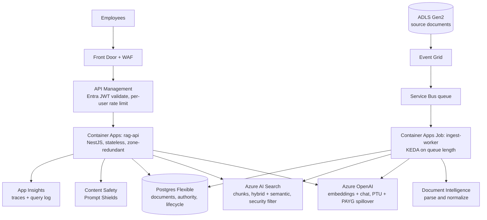

# Azure production architecture (Part 2)

Design only, no Azure account used. Targets the assumptions in [01-spec-summary.md](../context/01-spec-summary.md):
60,000 docs (~180 GB), ~200 changes/day, 5,000 employees, 20 req/s peak, P95 < 6 s, zero unauthorized
disclosure, region residency, high-risk requests fail safe during outages.

The local prototype is the same pipeline. Only adapters change, because security and trust decisions
live in code (see [03-backend-architecture.md](../context/03-backend-architecture.md)), not in the model or the store.

## Port to service mapping

| Port / concern | Local (built) | Azure (design) |
|---|---|---|
| `EmbeddingPort` | `@huggingface/transformers` ONNX, CPU | Azure OpenAI `text-embedding-3-small` (or 3-large truncated) |
| `LlmPort` | Ollama via `openai-compat` | Azure OpenAI, same `openai-compat` adapter |
| `RerankerPort` | `Xenova/bge-reranker-base` | Azure AI Search semantic ranker |
| `VectorStorePort` | Postgres 17 + pgvector | Azure AI Search (hybrid + security trimming) |
| Identity | `identities.json` lookup, impersonation | Entra ID, group claims from the token |
| Injection scan | `injection.scanner.ts` at ingest | same scanner, plus Content Safety Prompt Shields at query time |
| Audit + trace | none yet | App Insights + Log Analytics, see [12-observability.md](../context/12-observability.md) |
| Config | `.env` + zod | App Configuration + Key Vault, same zod schema |

## Topology

One region, paired region in the same geography for DR. Every hop uses private endpoints, so no
service is reachable from the public internet except Front Door. Managed identity everywhere, no
keys in config. Customer-managed keys on Blob, Postgres, AI Search and the observability store.

## Request flow in production

Unchanged from the local pipeline, with two additions:

1. **Identity.** APIM validates the Entra token. Groups come from the token claims, or from Microsoft
   Graph when the user exceeds the group-claim limit (over ~200 groups, the token carries an overage
   claim instead of the list). Group lookups are cached for a short TTL, because a stale ACL is a
   disclosure risk. Failure to resolve groups denies the request.
2. ACL pre-filter, now an AI Search filter expression built from those groups, `deny_groups` first,
   default deny.
3. Lifecycle and authority precedence: unchanged code, fields are filterable index fields.
4. Evidence gate: unchanged, still deterministic and still runs before any model call.
5. **Prompt Shields** on the question and on retrieved chunks, in addition to the ingest-time scanner.
   It is a second layer, not the control: permissions were already decided in step 2.
6. Generation, JSON schema, temperature 0, documents wrapped as untrusted data.
7. Output validation: unchanged.
8. Trace and query-log write, off the latency path ([12-observability.md](../context/12-observability.md)).

## Scaling strategy

### API tier

Stateless, and almost all of its wall-clock time is spent waiting on the LLM and on search, so a single
Node process holds many concurrent requests cheaply.

- Little's law: 20 req/s at ~5 s per request is about **100 requests in flight**.
- Container Apps with a KEDA HTTP rule on concurrent requests, ~30 per replica, min 3 (zone spread),
  max ~10. Min 3 is for availability, not for load.
- Move embedding to Azure OpenAI so replicas stay I/O bound. In-process ONNX embedding costs ~1.4 s of
  CPU per query on an M1 and would make the API the bottleneck.
- Keep-alive HTTP agents and bounded connection pools to every downstream, so a downstream slowdown
  becomes a fast rejection instead of an unbounded queue.

### LLM tier (the real constraint)

Two separate problems: throughput and latency.

**Throughput.** 20 req/s = 1,200 req/min. At ~2.5K input tokens (6-8 chunks plus system) and ~300 output
tokens, that is roughly **3M input TPM and 0.4M output TPM** at peak.

- Provisioned throughput (PTU) sized for the steady peak, pay-as-you-go deployment behind it for
  spillover and for traffic above forecast. Route with a retry on 429 to the secondary deployment.
- PTU count comes from a load test, not from a spreadsheet. Sizing before measurement is guesswork.

**Latency.** 300 output tokens at 60-100 tok/s is 3-5 s, which is most of the 6 s budget on its own.

- Cap `max_tokens` at ~300 and keep the JSON claim objects compact. Output length is the single biggest
  latency lever we control.
- Send at most 6-8 chunks after reranking. More context means slower prefill and no measurable quality gain.
- Mini tier model by default. Escalate to a larger model only for cases the evals show it needs.
- Stream to the client for perceived latency. The status stays provisional until the validator has run on
  the complete JSON, so a streamed answer is never marked `answered` before validation.
- Answer cache keyed by `(question_norm, groups_hash, index_version, model_id)`. The group hash is part of
  the key so a cached answer can never cross a permission boundary, and the index version invalidates the
  cache on reingest.

### Retrieval tier

- **Size.** [06-sizing.md](../context/06-sizing.md) estimates up to ~30M chunks. At 768 dims that is ~90 GB of float32
  vectors before the index. Use scalar or binary quantization with rescoring, which cuts vector storage
  several times over with little recall loss. Partition count follows from the quantized size, measured on
  a pilot ingest.
- **Query load.** 20 queries/s is light. Use 3 replicas, which is also the minimum for the read-write SLA,
  spread across zones.
- Replicas and partitions scale independently, which is the main reason to prefer AI Search over pgvector
  at this size: an HNSW index over 30M chunks needs hundreds of GB of RAM on a single Postgres instance.
- Security trimming is a filter on `allowed_groups` / `deny_groups` inside the query, never a post-filter.
  This is the same rule as `search.sql.ts` locally: a post-filter silently loses recall and, worse, means
  restricted chunks briefly exist in the candidate set.
- Postgres Flexible stays as the system of record for documents, authority and lifecycle state, and for
  ingest bookkeeping. AI Search holds chunks and is rebuildable from it.

### Ingestion tier

- 200 changes/day is ~90K chunks/day at worst, trivial. The **initial backfill of 60K documents is the
  real job**: use the Azure OpenAI Batch API and N parallel workers, scaled by KEDA on Service Bus queue
  length. Batch is far cheaper than synchronous calls and the backfill is not latency sensitive.
- Workers are idempotent, keyed by `(document_id, version, content_hash)`. Reprocessing the same message
  is a no-op. Failures land in a dead-letter queue with the original message intact.
- Checksum verification, ACL resolution, injection scan and authority cross-check run exactly as they do
  locally, before anything is embedded.
- **Permission changes must not require re-embedding.** An ACL-only change patches the filter fields on
  the document and its chunks in one transaction, then patches the index. Target propagation in minutes,
  and alert when the lag exceeds it, because a stale ACL is the highest-severity bug this system can have.
- `index_version` is recorded on every write, same contract as `index_meta` locally: search refuses to run
  against a mismatched index rather than returning quietly wrong results.

## Latency budget (P95 6 s)

| Stage | Budget | Timeout |
|---|---|---|
| Front Door + APIM + auth | 100 ms | 1 s |
| Query embedding | 200 ms | 800 ms |
| Hybrid search + semantic rank | 600 ms | 1.5 s |
| Authority, gate, prompt build | 50 ms | 200 ms |
| LLM (first token + ~300 tokens) | 4.5 s | 8 s hard cap |
| Output validation | 50 ms | 200 ms |

Each timeout is enforced with an `AbortSignal`, which `GenerateRequest` already carries. Total budget is
checked per request: if the stages so far have already consumed too much, the LLM call is skipped and the
request fails safe rather than answering late.

## Trust boundaries

| Boundary | Rule |
|---|---|
| Client to API | Client sends a question and a token. It never sends groups, filters or document ids |
| API to search | Groups resolved server-side. Filter built server-side. Default deny |
| Corpus to prompt | Document text is untrusted data, wrapped and labeled. It carries no authority |
| Model to system | The model has no tools, no network and no ability to widen a filter. It writes prose from evidence that was already filtered |
| Model to answer | Claims without valid citation ids are dropped by the validator, not trusted |
| API to logs | Traces are stored in full (internal system) but read through a privileged, audited role |

The ordering is the security property: permissions are decided before retrieval, so a fully compromised
model still cannot see or leak a document the user may not read.

## Failure handling

| Dependency | Behavior |
|---|---|
| Entra / group resolution | Deny. No cached fallback that widens access |
| AI Search down or timeout | Refuse. Never answer without ACL-filtered evidence |
| Azure OpenAI 429 | Retry with jitter on the spillover deployment, within the remaining budget |
| Azure OpenAI down | Low-risk questions return permitted sources with no generated prose. High-risk questions (HR, legal, restricted classification, injection flag) refuse |
| Prompt Shields down | Fail closed for flagged-category questions, open for the rest. The ingest-time scanner and the pre-filter still stand |
| Postgres down | Search still answers; authority relations fall back to the values denormalized on chunks. Ingest stops |
| Observability sink down | Requests continue. Persistent write failure raises an alert |

Circuit breakers on every downstream, so a sick dependency degrades fast instead of burning the whole
latency budget on every request. Retries are bounded and budget-aware, never open-ended.

DR: the paired region holds a warm standby API, a second Azure OpenAI deployment and a replicated index.
Both regions stay inside the residency geography, so a Data Zone or regional deployment is required.
Global deployments are not acceptable for this requirement.

## Release and regression control

- CI: unit tests, contract tests (run against a real AI Search index as well as pgvector, the
  `VectorStorePort` contract suite already exists), then `pnpm eval` as a **release blocker**. The eval
  runner does not exist yet and is the highest-priority gap, per incident 4.
- Deploy with Container Apps revisions: 5-10% canary, automatic rollback on eval failure, P95 breach, or
  cost-per-request regression.
- Model and prompt changes go through the identical gate. A model version bump is a code change.
- Continuous checks in production, from the query log: refusal-rate drift, validator-warning rate, and a
  standing ACL query that must return zero rows ([12-observability.md](../context/12-observability.md)).

## Cost shape

Dominated by the LLM, then by AI Search capacity, then by the one-time backfill embedding.

- Answer LLM: cut by output cap, mini tier default, cache, and the evidence gate (refusals never call it).
- Search: partitions follow quantized index size, replicas follow the SLA, not load.
- Backfill: Batch API, one time. Daily churn is negligible.
- Track cost per answered question as a release metric, next to P95. A prompt change that doubles context
  is a cost regression even when quality is flat.

## Migration path, in priority order

1. **Entra ID auth, remove the impersonation playground.** Biggest current gap: the server is safe today
   only because `main.ts` binds to `127.0.0.1`.
2. **Azure OpenAI for LLM and embeddings.** Config change, the `openai-compat` adapter already covers it.
3. **Observability: request id, query log, replay, traces** ([12-observability.md](../context/12-observability.md)).
4. **Eval runner in CI** as a release blocker.
5. Azure Postgres Flexible + pgvector with the existing adapter, for a pilot-size corpus. Proves the Azure
   path with zero retrieval code change.
6. AI Search adapter behind `VectorStorePort`, validated by the same contract suite, then cut over.
7. Event-driven ingest with Document Intelligence, then the full backfill.
8. PTU sizing from load tests, answer cache, DR region.

Steps 1-4 are valuable even if the Azure move never happens. Steps 5-6 are the point of the hexagonal
architecture: the pipeline, the guardrails and the tests do not change.

## Open items

- Chunk count is an estimate. 180 GB over 60K docs is ~3 MB per document, which may be far fewer pages
  than the 450/doc assumption in [06-sizing.md](../context/06-sizing.md). Partition sizing must come from a pilot
  ingest, not from that number.
- Purge window versus trace retention: soft-deleted chunks must outlive traces or replay breaks. See
  the open question in [07-open-questions.md](../context/07-open-questions.md).
- Whether the semantic ranker replaces the cross-encoder entirely, or the cross-encoder stays for
  high-risk questions. Decide from eval numbers.
